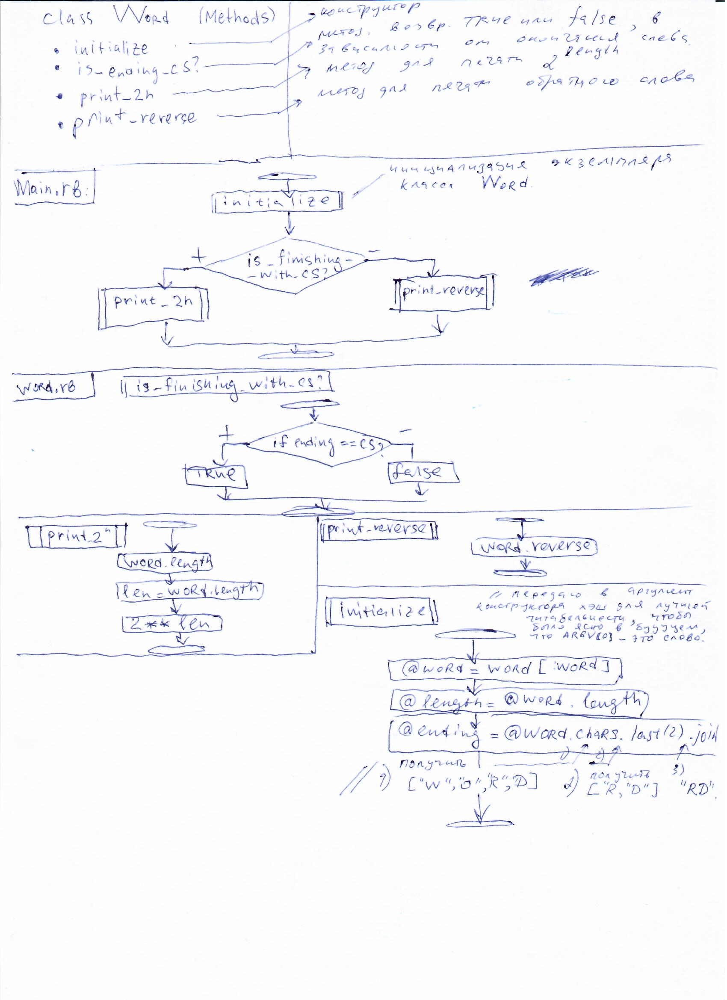

 Написать скрипт, который будет принимать слово, если слово заканчивается на `CS`(в любом регистре) - выводит на экран цифру 2 в степени (длины введенного слова), если не заканчивается - выводит слово задом наперед.

#Пример запуска:

ruby main.rb hello

